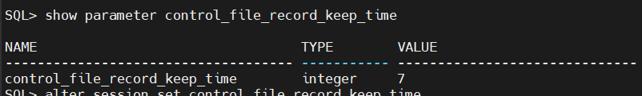
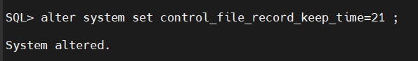
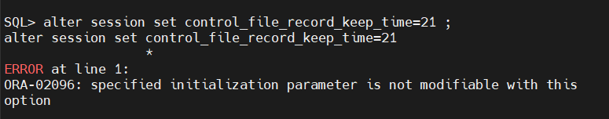
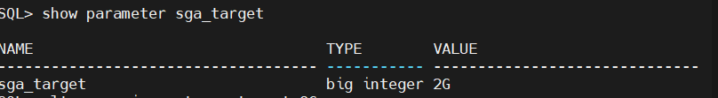
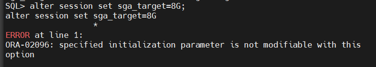
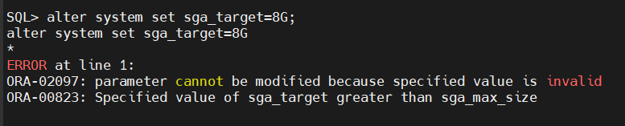
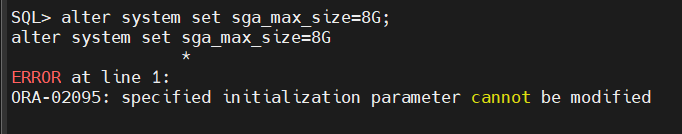
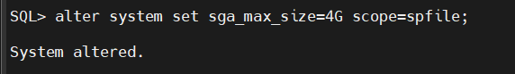

## 🔬 Lab Exercise Steps & Solutions

### Step 2: Change value of parameter `control_file_record_keep_time` to 21

#### 1. System Level Alteration

```sql
show parameter control_file_record_keep_time

```


```sql
alter system set control_file_record_keep_time=21;

```



#### 2. Session Level Alteration Attempt

```sql
alter session set control_file_record_keep_time=21;

```



#### Architectural Analysis: Why did the ORA-02096 error appear?

The `control_file_record_keep_time` parameter dictates how many days backup history is retained inside the physical control files before being overwritten. Because there is only **one shared set of control files** for the entire database instance, Oracle blocks individual users from altering this behavior locally. It is structurally constrained as a global setting and can only be altered using `ALTER SYSTEM`.

---

### Step 3: Show value of SGA_TARGET, Try to change it to 8G. What did you notice?

#### 1. View Current Status

```sql
show parameter sga_target

```


#### 2. Session Level Alteration Attempt

```sql
alter session set sga_target=8G;

```


same previous error, sga_target is a  system-level global setting too.

#### 3. System Level Alteration

```sql
alter system set sga_target=8G;

```


#### Observations:

The system explicitly rejected the modification. This occurred because `8G` exceeds the current memory ceiling profile defined by `sga_max_size`.

---

### Step 4: How to solve the error of step 3?

To resolve this conflict, the hard boundary limit (`sga_max_size`) must be expanded first. 
However, attempting a direct dynamic modification fails:

```sql
alter system set sga_max_size=8G;

```


#### The Solution Workflow:

`sga_max_size` is a **static parameter**, meaning its value sets the shared memory block size allocated by Linux at boot time. It cannot be altered in active memory. To change it, you must update the static Server Parameter File (`SPFILE`) and recycle the instance:

```sql
-- 1. Write the new boundary size to the persistent SPFILE profile
alter system set sga_max_size=4G scope=spfile;
```


```sql
-- 2. Cleanly restart the instance to request the new allocation from Linux
SQL> shutdown immediate;
Database closed.
Database dismounted.
Oracle instance shut down.

SQL> startup;
ORACLE instance started.
Database mounted.
Database opened.

```

after the startup , we can change the sga_target to 8G.


