## 🔬 Continue Lab 2
### Step 5: After changing sga_max_size to 8G 

#### 1. Error when startup again

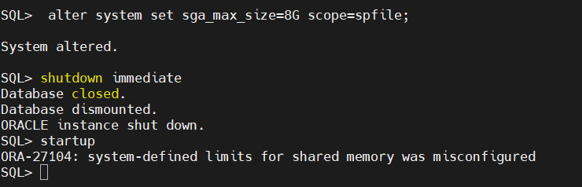

#### 2. Solution 

creation of pfile , edit the value in it 

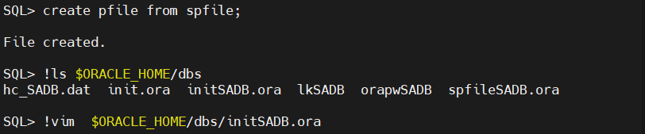

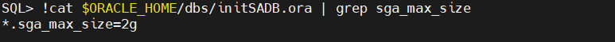

#### 3. Startup by pfile and overwrite spfile

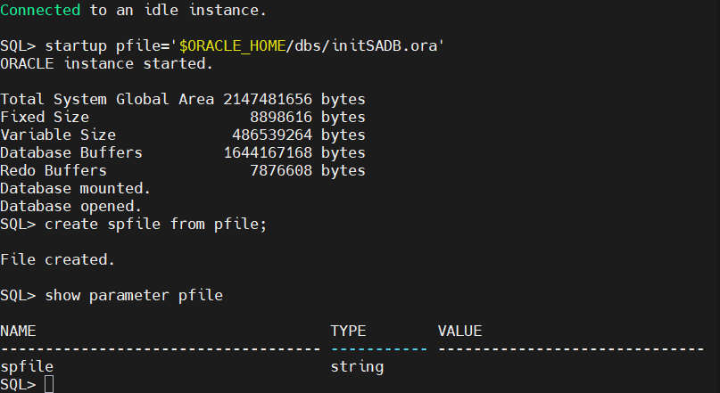

#### 4. Startup again 

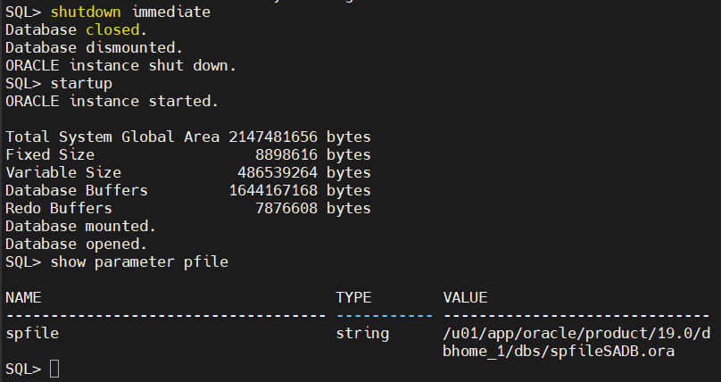

---
---

## 🔬 Lab 3

### Step 1: shutdown "SADB" with the most safe and fast method.

- Safe but will take a long time --> normal , transactional 
- Fast but not safe --> abort 
- Then, most suitable way for safe and fast shutdown --> immediate

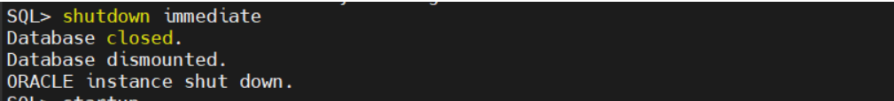

### Step 2:  Startup "SADB" step by step.

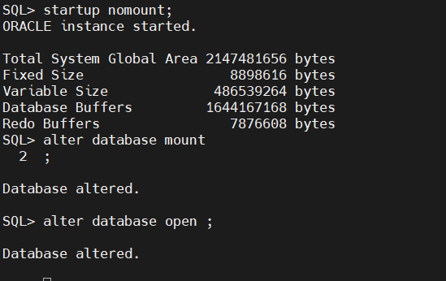

### Step 3:  Show

#### 1. Show the version of your database using the view "v$version"

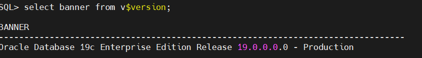

#### 2. Show hostname, instance name, status, open mode and startup_time using the views "v$instance" and "v$database"

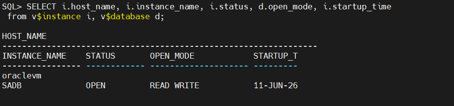

##### 3. Show the name and type of parameter "db_create_file_dest" using view "v$parameter"

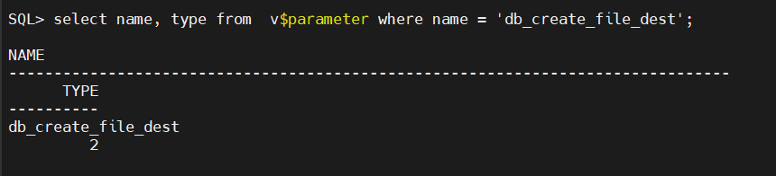

### Step 4:  Create PERMANENT tablespace

- tablespace with name "iti_data" with two data files with intial size 50 MB each, 250 MB maxsize and increment of 10 MB

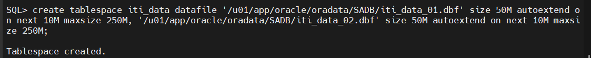

### Step 5: Show using the views "dba_users" and "DBA_ROLE_PRIVS"

- show the usernames, their passwords, their tablespace, their roles and their acccount status using the views "dba_users" and "DBA_ROLE_PRIVS"

- left join was used to return all users from dba_users, even if they don’t have any roles in dba_role_privs.

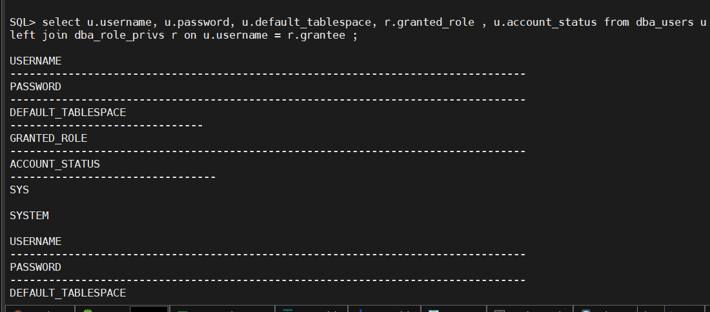

### Step 6: Show using view "dba_data_files".

- show data files names, thier tablespaces, their size, their status using view "dba_data_files"

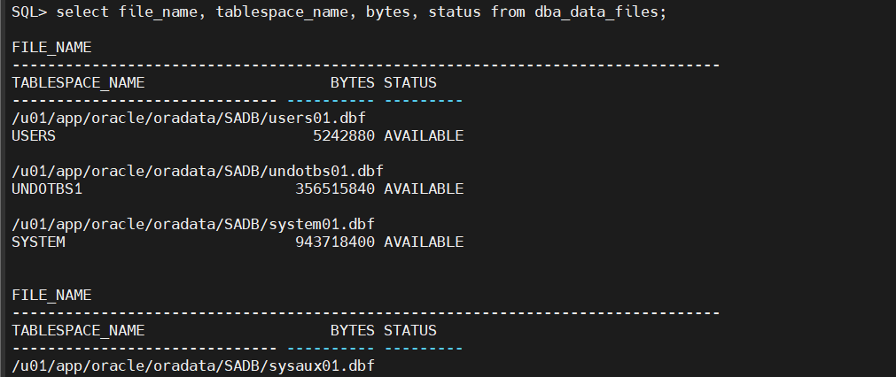

### Step 7: parameter undo_retention

- Show the value of parameter undo_retention then change the value of it to be 3 minutes and gurantee this duration.
 
##### 1. Show the current value:

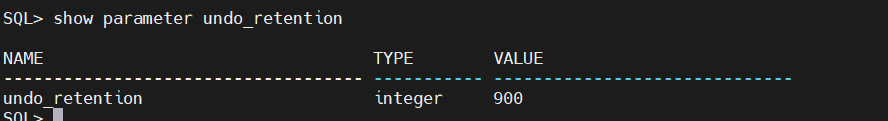

##### 2. Change the value to 3 minutes (180 seconds):

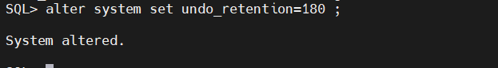

##### 3. Gurantee:

- Without Guarantee (Default): Oracle treats your 3 minutes as a suggestion. If it runs out of space, it overwrites your old data to keep the database moving.

- With Guarantee: Oracle treats your 3 minutes as a strict law. If it runs out of space, it fails new database changes (user gets an "out of space" error) rather than breaking the 3-minute rule.

- undo tablespace name that oracle created by default 
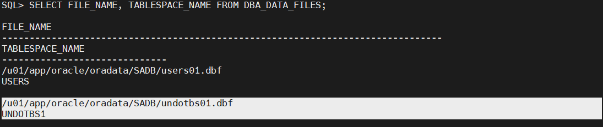

- so to gurantee retention:

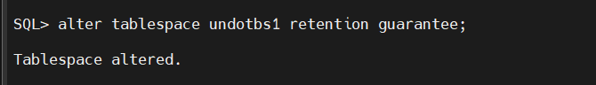

### Step 8: Create new undo tablespace

- reate new undo tablespace with name "NEWUNDO" with size 100 MB, and make it the default undo tablespace for the database instance.

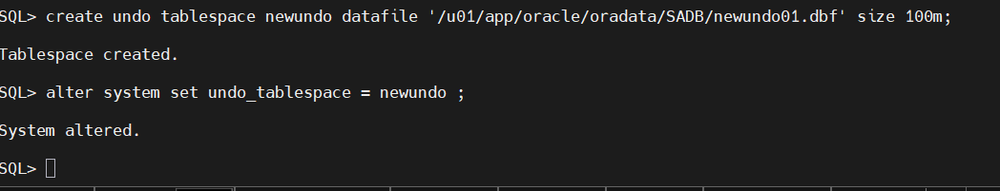

### Step 9: View the redo log files

-  view the redo log files names, size, group number, status, archived or not and their sizes in MB using the views "v$log" and "v$logfile".

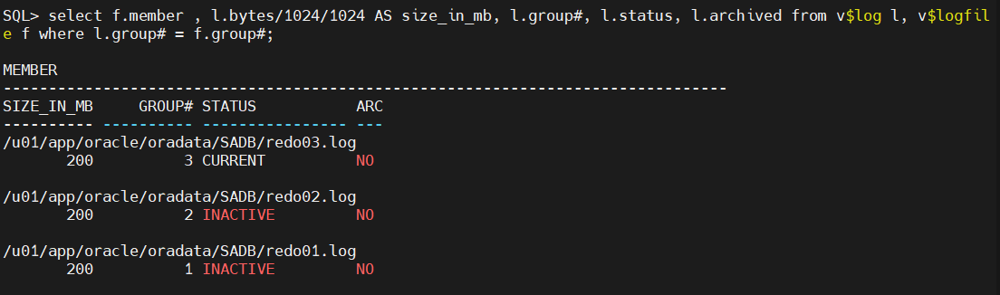