## 🔬 Lab 4

### Step 1: Archivelog mode

- Show your archiving status then enable the archiving mode if not enabled and show your archiving status again.

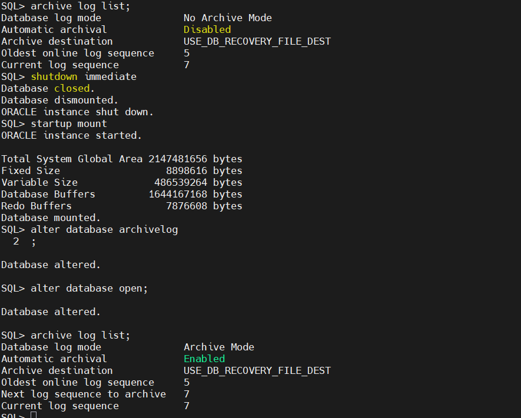

### Step 2: Alert log file

- Identify the location of the alert log file.

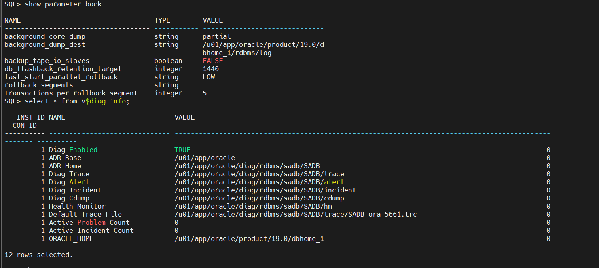

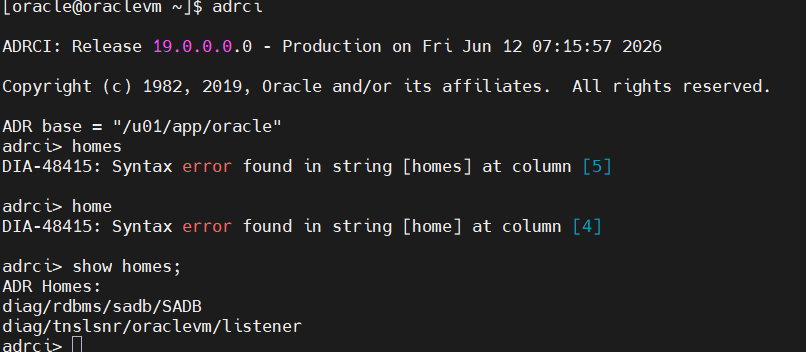

### Step 3: Monitor the alert log

- Shutdown "SADB" with the most safe and fast method. and monitor the alert log

```
 tail -100  /u01/app/oracle/diag/rdbms/sadb/SADB/alert/log.xml

```
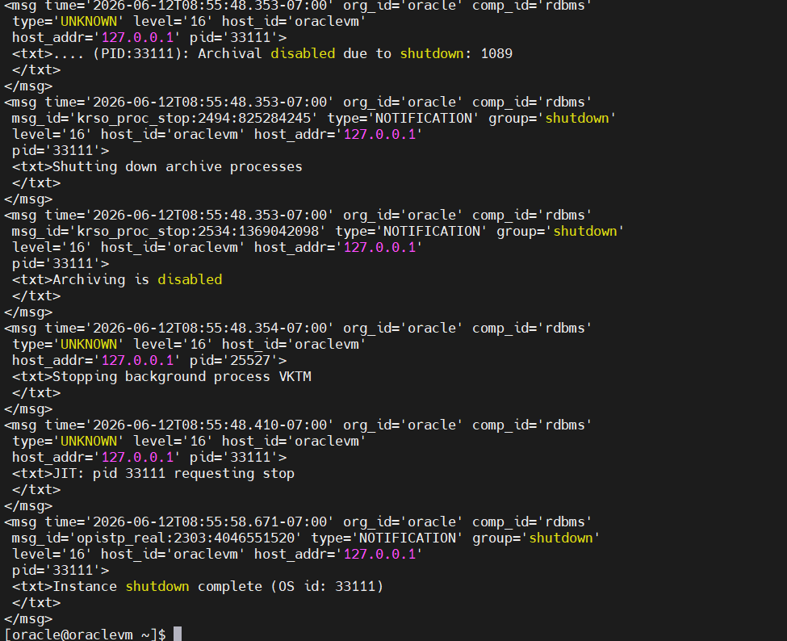

### Step 4: 

- Startup "SADB" step by step. and monitor the alert log

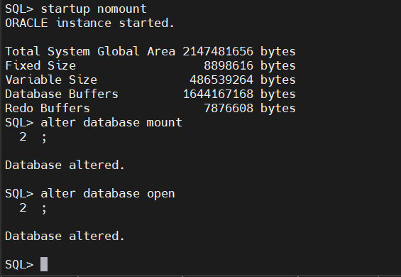

#### at startup nomount 

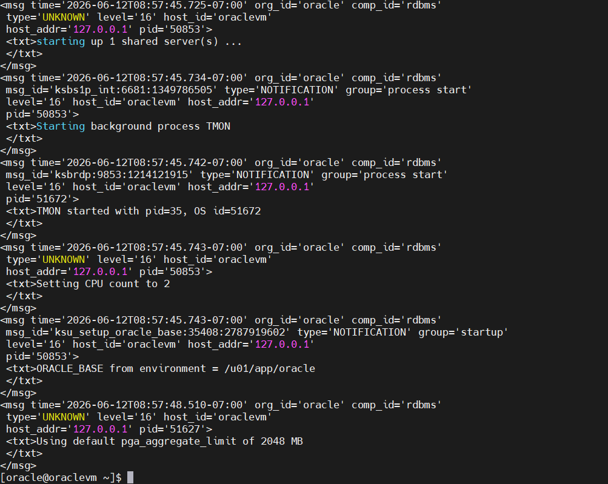

#### at alter database mount

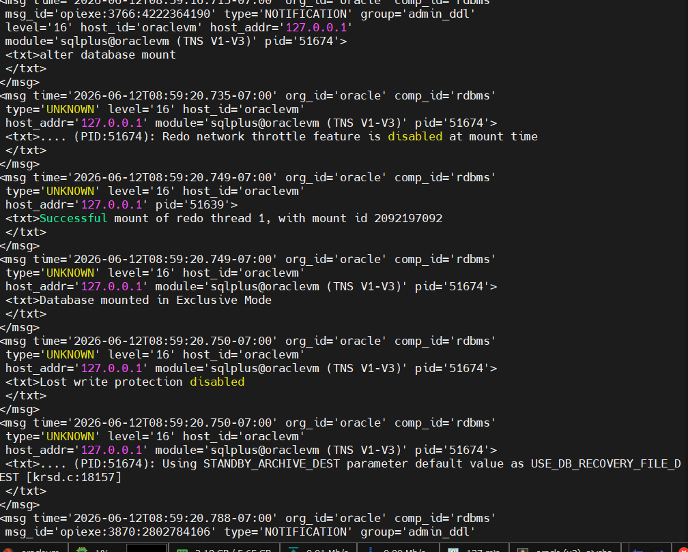

#### at alter database open:

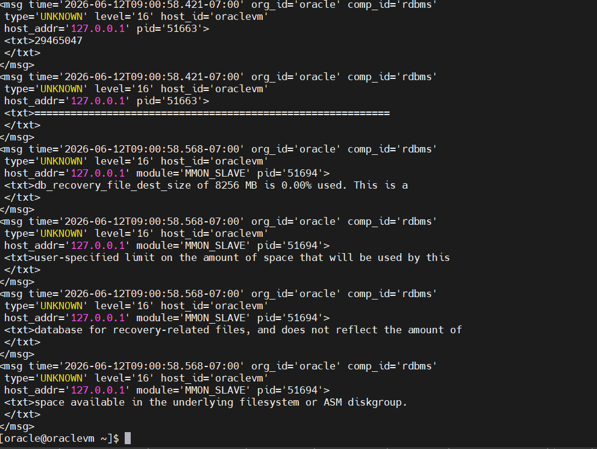

### Step 5: Create a user

- Create user "myuser" and make "iti_data" tablespace his default tablespace with unlimited quota on it.

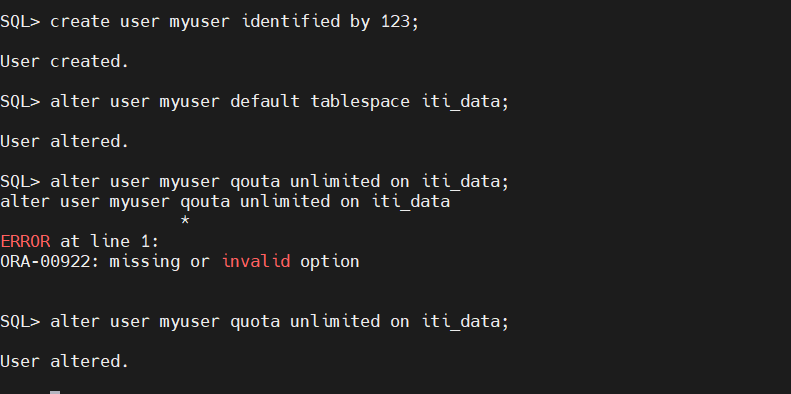

### Step 6: Connection trials

- try to connect with the new created user.

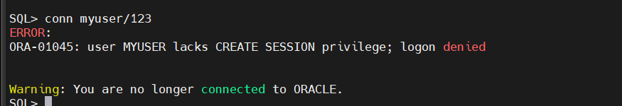

### Step 7: Giving user privilges

- give the new user connect, resource and create view privilges.

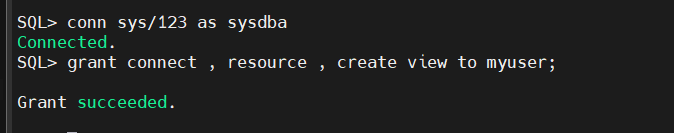

### Step 8: Monitor the alert log again

- shutdown "SADB" with the most safe and fast method. and monitor the alert log

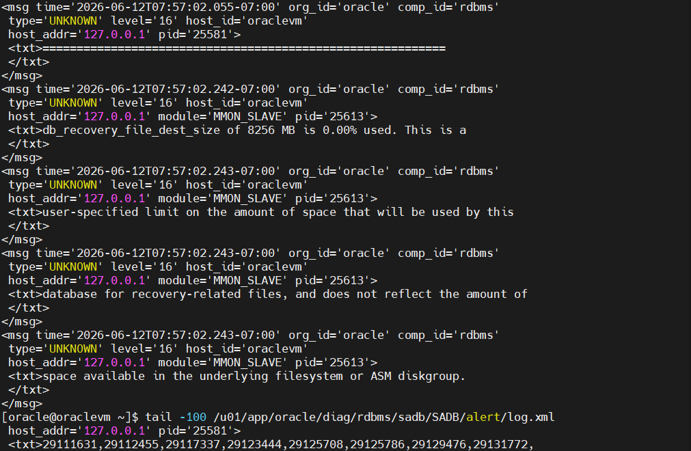

### Step 9: Unlock the hr user if locked.

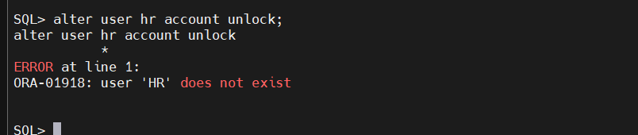

As far as i can remember, we didn't install the hr schema while installation.


- checking status of myuser:

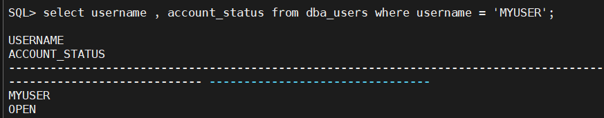

### Step 10: Create ROLE

- create role "myrole" including "create session" privelege, create view.
 --> to know what privileges in a role, query on dba_sys_privs view.

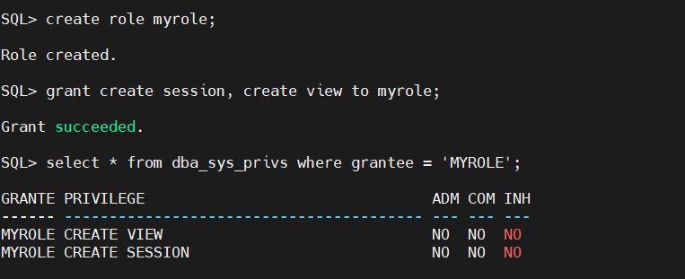

### Step 11: Create PROFILE

- create profile "myprofile" which restrict the password age of the user to be 5 days, number of failed logins to three times and restrict its connect time. 

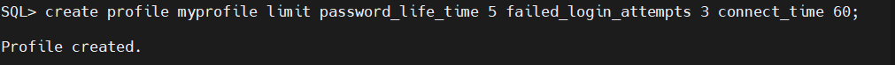

### Step 12:

- create an OS user with name "iti" and make him login to the database using "sqlplus /"

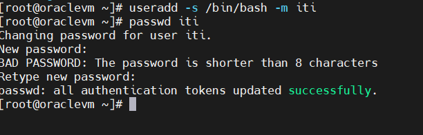

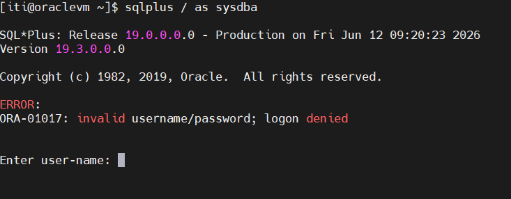

### Step 13:

- make your personal Operating system user to connect locally without authentication as sysdba.

#### solution was to add iti to dba group

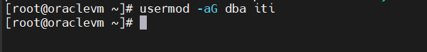

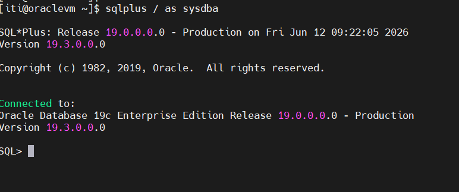

### Step 14:

- grant sysdba privlige to your created user "myuser" and then show all users that have sysdba privilige.

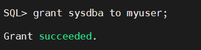

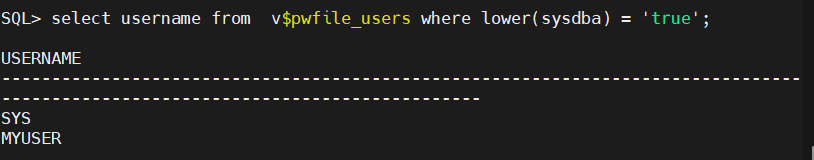
