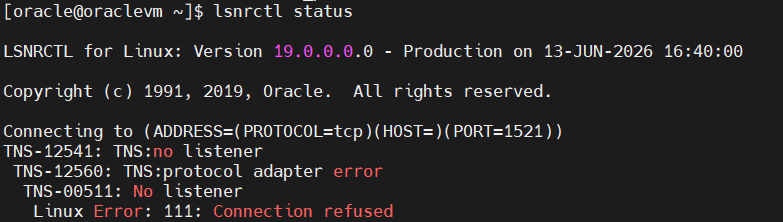
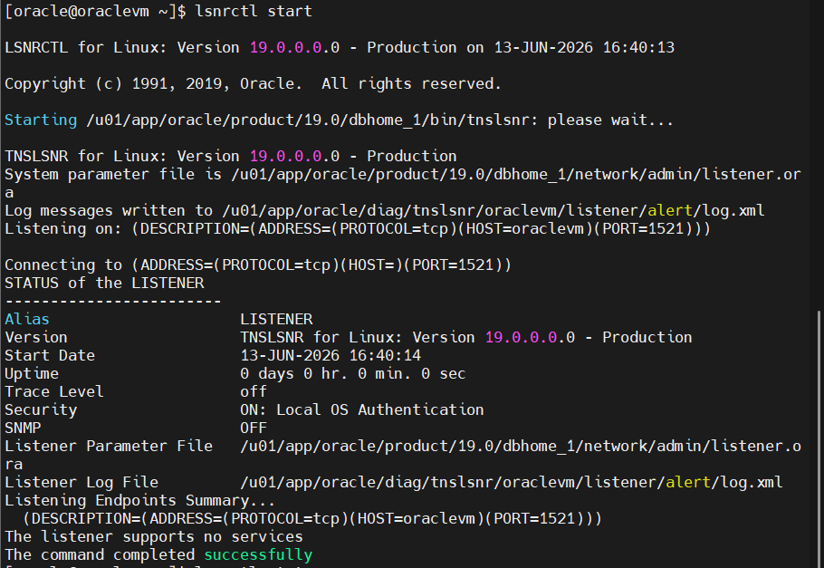
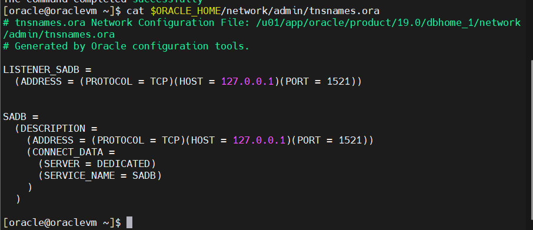
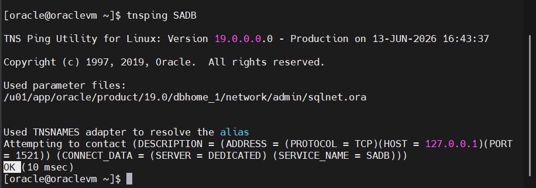
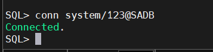
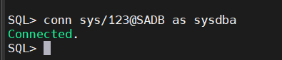
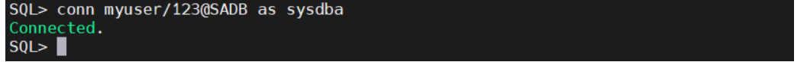

## 🔬 Lab 5

### Step 1:
- Show the status of the listener.

### Step 2:
- Start up your listener if not started.

### Step 3:
- view your tnsnames file configuration.

### Step 4:
- If your database is not configured in your tnsnames file then add it to the file and try to understand what is the contents of this file.

To make a connection, Oracle Net requires the client to know four specific details:
  The protocol the listener is using.  
  The host where the listener is running.  
  The port the listener is monitoring.  
  The service name the listener is handling.  

### Step 5:
- test the connection to your database using "tnsping" command.

### Step 6:
- connect to your database through network using system user.

### Step 7:
- Do the necessary steps to let sys user connect to the database instance through network.

### Step 8:
- Connect with your user "myuser" as sysdba through netwok.

